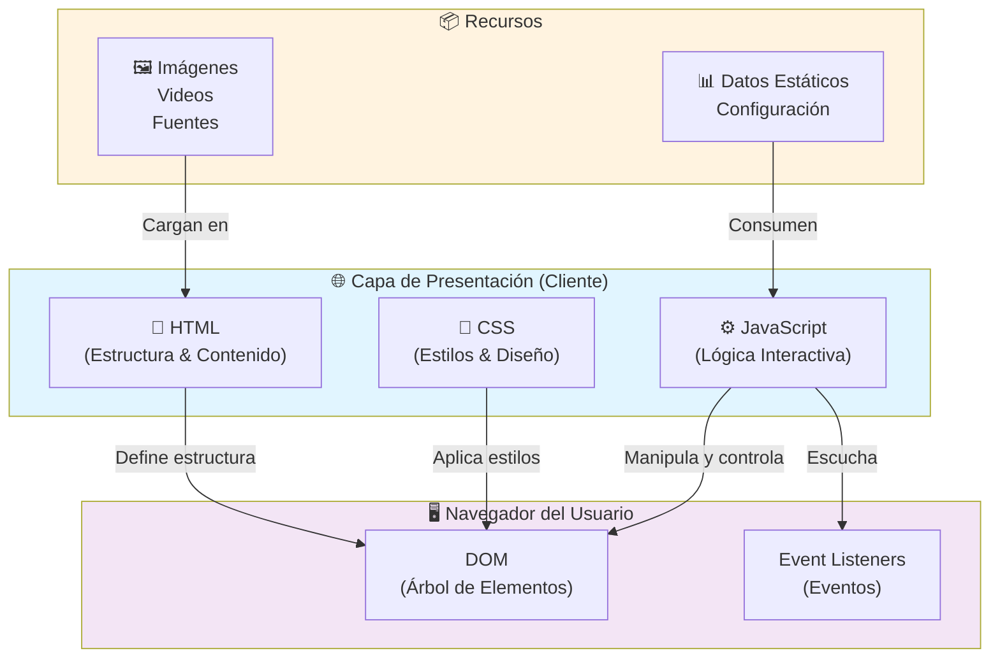
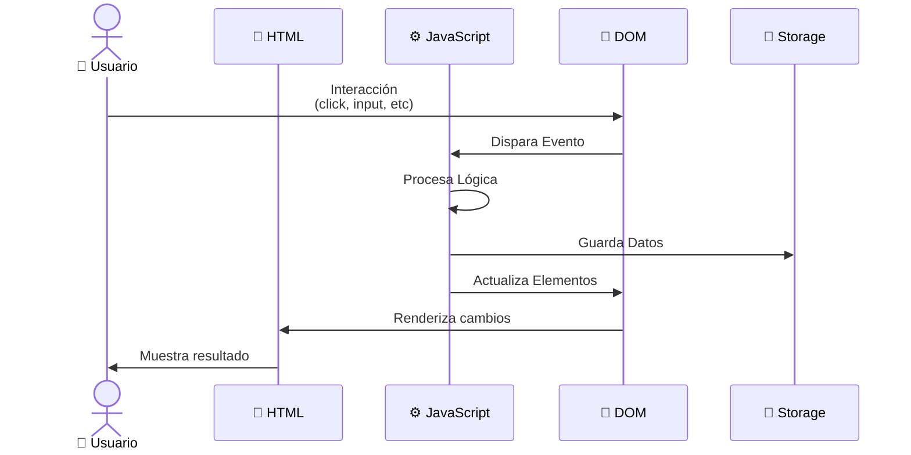
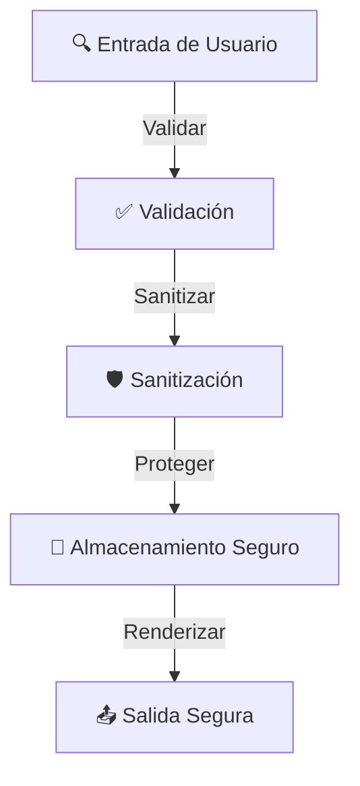
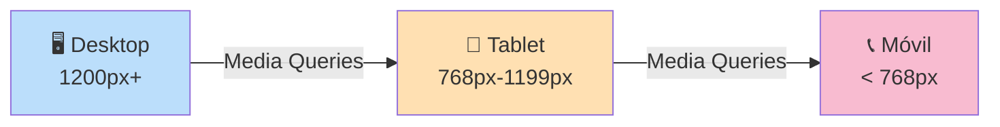
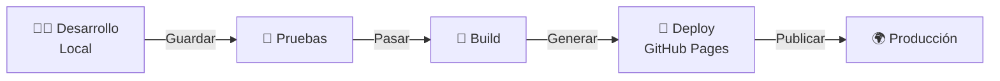

# Arquitectura - Mazaventura Mazamitla

## 📋 Descripción General

**Mazaventura Mazamitla** es una aplicación web frontend desarrollada con HTML y JavaScript. Presenta una arquitectura moderna enfocada en la experiencia del usuario y la interfaz interactiva.

**Composición tecnológica:**
- 📄 HTML: 79.9%
- ⚙️ JavaScript: 20.1%

---

## 🏗️ Diagrama de Arquitectura General



---

## 📐 Arquitectura por Capas

```mermaid
graph LR
    subgraph Presentación["Capa de Presentación"]
        direction TB
        Layout["🏗️ Layout & Estructura"]
        UI["🎯 Componentes UI"]
        Styling["🎨 Estilos Visuales"]
    end
    
    subgraph Lógica["Capa de Lógica"]
        direction TB
        Handlers["📍 Manejadores de Eventos"]
        Validation["✅ Validación"]
        Manipulation["🔄 Manipulación de DOM"]
    end
    
    subgraph Datos["Capa de Datos"]
        direction TB
        LocalStorage["💾 LocalStorage"]
        SessionData["📋 Datos en Sesión"]
        StaticData["📁 Archivos Estáticos"]
    end
    
    Presentación -->|Interactúa con| Lógica
    Lógica -->|Lee/Escribe| Datos
    
    style Presentación fill:#e3f2fd
    style Lógica fill:#fff9c4
    style Datos fill:#f1f8e9
```



---

## 🔄 Flujo de Datos



---

## 📁 Estructura de Carpetas Esperada

```
Mazaventura-Mazamitla/
├── 📄 index.html              (Punto de entrada principal)
├── 📄 *.html                  (Páginas adicionales)
├── 📁 css/
│   ├── 🎨 styles.css          (Estilos globales)
│   └── 🎨 responsive.css      (Estilos responsivos)
├── 📁 js/
│   ├── ⚙️ main.js             (Script principal)
│   ├── ⚙️ events.js           (Manejadores de eventos)
│   ├── ⚙️ validation.js       (Funciones de validación)
│   └── ⚙️ utils.js            (Utilidades generales)
├── 📁 assets/
│   ├── 🖼️ images/            (Imágenes del proyecto)
│   ├── 🎥 videos/            (Videos)
│   └── 🔤 fonts/             (Fuentes personalizadas)
├── 📁 data/
│   ├── 📊 config.json        (Configuración)
│   └── 📋 content.json       (Contenido estático)
└── 📄 README.md              (Documentación)
```

---

## 🔌 Componentes Principales

### 1. **HTML (Estructura)**
- Semántica HTML5
- Estructura de secciones y elementos
- Accesibilidad (ARIA attributes)
- Meta tags y SEO

### 2. **CSS (Presentación)**
- Estilos visuales
- Diseño responsivo (Mobile-first)
- Animaciones y transiciones
- Temas y paleta de colores

### 3. **JavaScript (Interactividad)**
- Manipulación del DOM
- Manejo de eventos
- Validación de formularios
- Almacenamiento de datos (LocalStorage/SessionStorage)
- Lógica de negocio

---

## 🔐 Consideraciones de Seguridad



**Prácticas recomendadas:**
- ✅ Validar entrada del usuario
- ✅ Evitar inyecciones XSS
- ✅ Usar HTTPS en producción
- ✅ No almacenar datos sensibles en LocalStorage
- ✅ Content Security Policy (CSP)

---

## 📱 Responsive Design



---

## 🚀 Flujo de Desarrollo



---

## 📊 Matriz de Dependencias

| Componente | Depende de | Impacta en |
|------------|-----------|-----------|
| HTML | CSS, JS | DOM, Presentación |
| CSS | HTML | Presentación visual |
| JavaScript | HTML, CSS, Storage | Interactividad, DOM |
| LocalStorage | JavaScript | Persistencia de datos |
| Navegador | HTML, CSS, JS | Renderizado |

---

## 🔄 Mejoras Futuras Sugeridas

- [ ] Implementar build tools (Webpack, Vite)
- [ ] Agregar testing (Jest, Cypress)
- [ ] Framework frontend (Vue.js, React)
- [ ] Backend API REST (Node.js, Python)
- [ ] Base de datos (MongoDB, PostgreSQL)
- [ ] CI/CD pipeline (GitHub Actions)
- [ ] TypeScript para mejor tipado
- [ ] Componentes web reutilizables

---

**Última actualización:** 2026-07-08  
**Mantenedor:** t898t7zgfd-png/Mazaventura-Mazamitla
